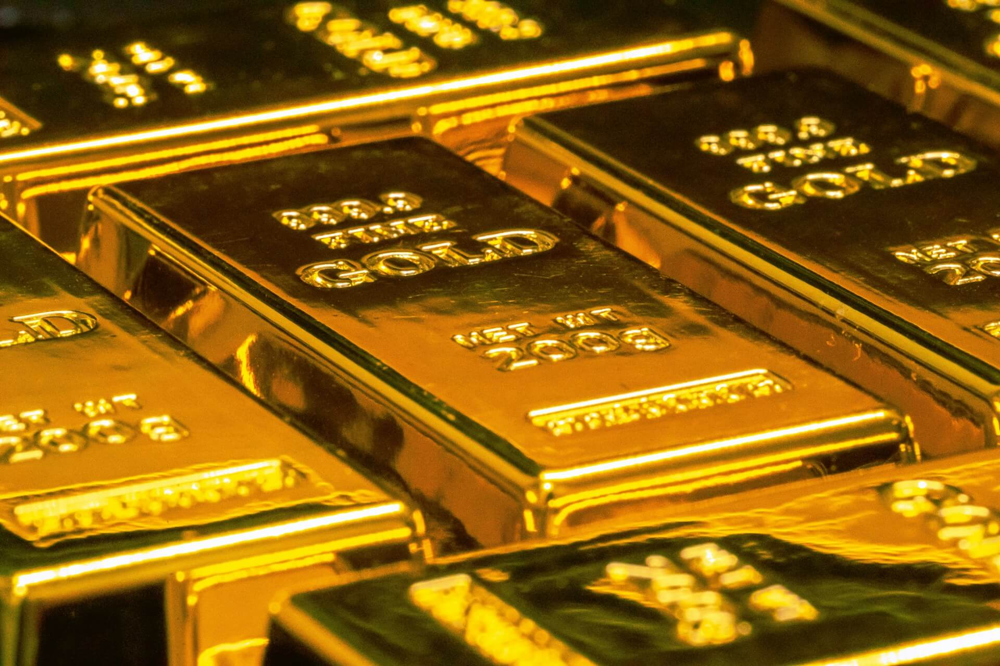

# Blood and Bullion: How Gold Fuels Sudan’s War

Gold doesn’t only glitter — in Sudan it bankrolls bullets, sieges and dispossession. **This war is a fight between two rival kleptocracies:** the Sudanese Armed Forces’ (SAF) entrenched, state-based economic empire, and the predatory, gold-fuelled war economy of the Rapid Support Forces (RSF). The RSF has turned extraction into a war economy: controlling mines, harvesting cash, and converting land and lives into bullion that flows out through regional trade routes. At the far end of that chain sit Gulf and international markets — most notably the United Arab Emirates — whose appetite for opaque gold supplies helps keep the violence alive. Follow the money and you’ll find the modern face of neocolonial extraction.

---

## The RSF: from Janjaweed to mineralised power

The RSF’s origins in Janjaweed militias and its elevation under Mohamed Hamdan “Hemedti” Dagalo mean the force is as much a predatory commercial actor as a fighting unit. Over the last half-decade, control of mining zones — especially in Darfur and northern Sudan — shifted from ad-hoc looting to institutionalised revenue generation. Controlling mines gives the RSF territorial leverage, immediate cash and bargaining power in Khartoum and with external patrons. That is why extraction matters: when territorial control equals revenue, the logic of conflict changes — peace threatens profit.

## How much gold — and where it goes

Numbers vary, but independent analyses and UN expert findings point to substantial volumes. Estimates in 2024–2025 placed RSF-controlled output in the order of **tens of tonnes** across Sudan, with a significant portion effectively monetised off-book and channelled through neighbouring states and Gulf hubs. Gold is portable, high value per weight and easy to launder; that makes it ideal for financing irregular forces. Large shares of Sudan’s official exports have ended up in Egyptian transit points and Emirati markets, which then re-export refined bullion into global supply chains.

## The UAE’s role: market, leverage and plausible deniability

Be precise about allegations versus established fact. Investigations and reporting have repeatedly identified Emirati firms and intermediaries at the end of supply chains buying Sudanese gold; leaked documents and UN reporting have traced routes that could move both bullion and, in some cases alleged by journalists and activists, materiel. The UAE denies direct provision of weapons to the RSF. Whatever legal responsibility is ultimately determined to be, the economic truth is straightforward: Gulf demand — particularly through the UAE’s refineries and bullion markets — gives huge monetary value to the seizure of Sudanese mines. When Emirati restrictions and flight suspensions hit Sudanese exports in October 2025, the Sudanese pound plunged — stark evidence of how dependent Sudan’s wartime economy had become on those markets.

## From mine to militia: the cash pathways that keep the war running

The chain is simple and brutal: RSF (or RSF-aligned brokers) control a mine → local traders buy rough gold → cross-border brokers and refiners move the metal through neighbouring states → bullion dealers in Gulf markets buy or refine it into standard bars for resale. Cash flows quickly back into RSF coffers to pay fighters, fuel operations, contract logistics and patronage networks. High gold prices since 2023 turbocharged extraction, turning areas that once offered seasonal livelihoods into militarised, extractive frontiers.

## Ecological and human devastation: extraction as ecocide

Wartime mining is ecocide in slow motion. Artisanal pits scar landscapes; **ore-processing, which often uses vast, unregulated quantities of mercury,** contaminates water, **inflicting severe, generational neurological damage on local populations.** Farmland and grazing lands are destroyed; and unregulated pits multiply, creating long-term hazards. Environmental oversight collapses under conflict, and the people who once relied on the land are dispossessed. Human-rights organisations document systematic abuses in mining areas: forced displacement, sexual violence, summary executions and the targeting of displaced camps. Extraction thus produces a triple assault — physical violence, economic dispossession and ecological ruin.

## A decolonial, eco-social reading: who benefits and who pays

This is structural, not accidental. Local strongmen and brokers capture resource rents; regional intermediaries and Gulf buyers monetise them; multinational refiners and traders integrate bullion into global markets. Wealth flows out; the social and ecological costs remain. That pattern is the persistence of colonial extraction in new clothing: dispossession rather than settlement, financial intermediation rather than direct colonial administration.

An eco-socialist frame points us to the levers of power. Treating the crisis as merely a security problem misses the economic incentives that sustain it. The RSF won’t disarm while gold keeps funding it; foreign buyers won’t change behaviour while profit and laundering opportunities remain available. Ending the war requires dismantling the commercial architecture that makes control of mines so valuable.

## What must change: concrete policy demands

A decolonial solidarity programme must centre enforceable measures that target buyers and enablers, not ordinary miners.

- **Binding traceability and due diligence**
    Require provenance documentation for all gold entering consumer markets. Strengthen conflict-minerals frameworks to cover gold with legal obligations on refiners and downstream buyers.

- **Targeted financial sanctions**
  m Impose designations and asset freezes on middlemen, brokers and companies the UN or credible investigations identify as facilitating illicit flows — while shielding ordinary miners and communities from collateral harm.

- **Banking and AML enforcement in transit hubs**
    Regulators in Dubai, Abu Dhabi and other hubs must implement and enforce anti-money-laundering provisions for bullion dealers and correspondent banks. Where financial institutions process suspicious flows, they must face consequences.

- **Support for local documentation, land rights and remediation**
    Fund Sudanese civil society groups documenting abuses; back community land-rights programmes and participatory environmental remediation; and prioritise reparations and restitution for affected communities.

- **Legal accountability where evidence exists**
    Where credible evidence shows arms or logistical support in breach of UN resolutions or international law, pursue legal scrutiny through appropriate international mechanisms. Follow the money as rigorously as weapons transfers.

## Solidarity tactics for activists and movements

If you want to end the war, pressure the markets, not the victims. Successful strategies include: naming and shaming refineries and exchanges that accept unverified gold; shareholder campaigns targeting refiners and bullion houses; legal challenges and Freedom of Information pressure where public institutions obscure trade; and coordinated petitions to central banks and regulators. Crucially, centre Sudanese voices and demands — supply-chain transparency and reparations must be defined by those harmed.

> “To solve the war in Sudan, we have to follow the gold, and we arrive at the UAE.”
> — Marc Ummel, researcher with SWISSAID

## Conclusion — follow the bullion

This conflict is not only about rival generals and contested state power. It’s about a political economy that turns people and ecosystems into extractable value. Gold — portable, valuable and easy to monetise — has become the fuel of Sudan’s war. Gulf markets and actors who profit from opaque trade flows are not innocent bystanders: their demand makes the seizure of land worth the cost.

To stop the fighting we must choke the profits. That means enforceable traceability, targeted sanctions on enablers, banking and regulatory accountability in transit hubs, and a decolonial politics that centres Sudanese demands for restitution and democratic control over resources. **This strategy is essential for choking the RSF’s most profitable supply chain, though a key risk remains the diversion of this trade to other global actors, like Russia or China, who actively subvert such transparency measures.** Follow the money. It points to where the war will end — if we have the political will to take it apart.
