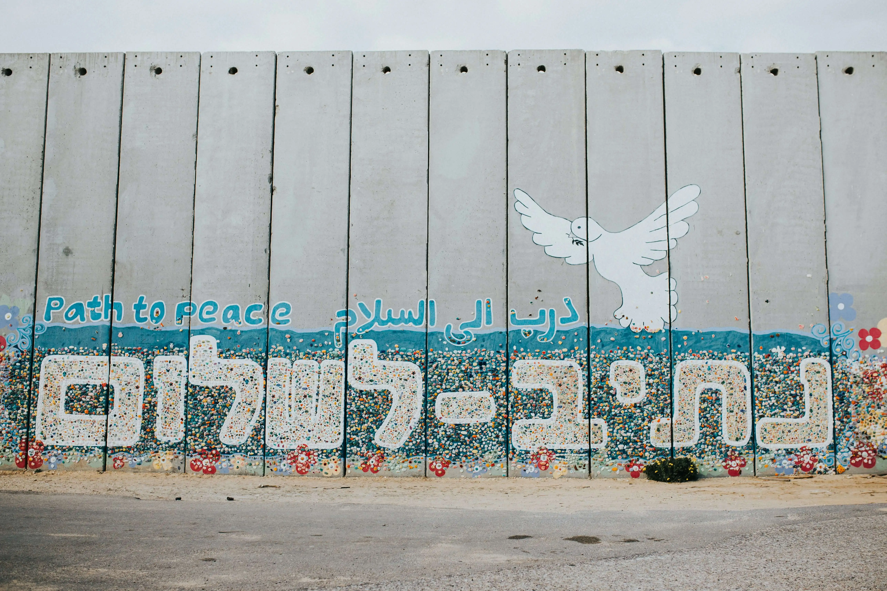

# Gaza and the Global South: Imperialism's Mirror

> "There will be no global climate justice, no global just transition without the liberation of Palestine."
> — Hamza Hamouchene, Transnational Institute (2025)

Gaza represents a mirror of empire, not an aberration.
The same powers that destroy forests in the Congo, exploit cobalt for "green" technologies, and impose debt on Africa are the ones supplying bombs and diplomatic cover to Israel.
Palestine reveals, in concentrated form, the moral and structural logic of global empire: domination through dispossession, justified by the language of civilisation, progress, and security.

As of late 2025, more than **67 000 Palestinians have been killed** since the assault on Gaza began in October 2023.
Entire hospitals and universities have been levelled. Over **two million people** remain trapped under siege — starved, bombed, and displaced in what UN experts call a _textbook case of genocide_.

Even the declared "ceasefire" offered no real reprieve. On **29 October 2025**, Israeli strikes during the truce killed **104 people in a single day**, including dozens of children, according to Gaza health authorities cited by _Reuters_.
A pause in war became another episode of annihilation, a reminder that for colonised peoples, peace under empire is often only a change in tempo.

This extends beyond war itself. It involves a world order built on the belief that some lives and some lands are expendable for profit and control.

---

## The Architecture of Domination

The genocide in Gaza did not begin in **2023.** It began with **settler colonialism**, the economic and racial logic of empire carried into the twenty-first century.
The British Mandate, the Balfour Declaration, and the Zionist project were all instruments of the same system that partitioned Africa, enslaved millions, and enclosed the Earth's commons for capital.

The methods evolve: sanctions instead of gunboats, drones instead of gunpowder; the structure endures — **the right to dominate, the right to extract, the right to decide who lives and who dies.**

In Palestine, this manifests as siege, surveillance, and bombing.
In the Congo, as mining concessions and military-backed dispossession.
In Haiti, as debt and occupation disguised as "stability."
And in Bolivia and Colombia, as militarised resource zones feeding global markets. Different geographies, one architecture.

---

## How Empire Operates

### Weapons as Commodities

Israel's bombardment of Gaza is enabled by a transnational military-industrial complex that profits from endless war.
The same corporations — **Lockheed Martin, BAE Systems, Thales, Northrop Grumman** — sell weapons tested on Palestinians and later exported as "battle-proven." Military occupation becomes a laboratory for repression, exported globally to police borders, refugees, and protesters.

### Finance and Control

Empire no longer rules by flag; it rules through **debt, trade regimes, and sanctions.**
IMF austerity in Africa, World Bank "development projects" in Asia, and U.S. sanctions on states that resist all sustain a hierarchy of dependence. The same countries that arm Israel also control the institutions that discipline the Global South.

### Media and Moral Legitimacy

The ideological front of empire is built through narratives: "self-defence", "democracy", "stability."
These words disguise structural violence, framing victims as threats and resistance as terrorism.

---

## The Ecological Dimensions of Occupation

Settler colonialism is not only a political project; it is an **ecological one.**
In Palestine, olive groves are uprooted, aquifers stolen, and farmland bombed into dust. In Africa, forests are razed for profit and rivers poisoned by mines. Both reflect the same logic: control nature, displace people, privatise life.

The **ecocide in Gaza** — the flattening of farmland, poisoning of soil and sea — mirrors the slow violence inflicted on ecosystems across the Global South. Climate collapse represents imperialism in its ecological form, rather than being accidental.

Demilitarisation and ecological regeneration are inseparable. The metals that build tanks could rebuild irrigation systems. The capital that funds war could restore rivers and forests. Every act of disarmament is an act of renewal.

---

## Global Solidarity in Practice

Across the Global South, Palestine has become a rallying point, not of charity but of shared experience.
From Johannesburg to Jakarta, from Caracas to Cairo, movements recognise Gaza as the **front line of global imperialism.**

- South African activists invoke apartheid memory to call for **boycott, divestment, and sanctions (BDS)** — echoing their own struggle.
- Congolese and Sudanese organisers link their battles against extraction to the fight against occupation.
- Indigenous movements in the Americas and Pacific see parallels in **land theft, militarisation, and cultural erasure.**
- In South Africa, the government's case at the **International Court of Justice (ICJ)** asserts what the Global North refuses to: that genocide cannot be justified by power.
- Across Latin America, Indigenous environmental defenders in Bolivia and Brazil connect their struggles against extractive violence to the Palestinian cause.
- Even in the Global North, youth climate movements defy state repression and publicly refuse the separation between _ecological_ and _anti-imperialist_ politics.

This is **internationalism reborn** — solidarity not as sentiment but as structure: an alliance of the dispossessed against empire in all its forms.

> "If you have come here to help me, you are wasting your time. But if you have come because your liberation is bound up with mine, then let us work together."
> — Lilla Watson and Aboriginal activists, Queensland (1970s)

---

## Empire or Life: The Fundamental Choice

The West calls this a "conflict."
But what we witness is the logic of **colonial modernity** laid bare: a civilisation that justifies genocide in the name of order, progress, or security.

To stand with Gaza is to stand against the system that treats life as expendable — the same system driving climate breakdown, debt slavery, and resource plunder. Eco-socialism and decolonisation are not abstract ideals; they are the practical demands of survival.

True solidarity means dismantling the global military-financial complex and building a world where resources serve life, not empire.

---

## Beyond the Current System

The task before us is not reform but replacement. A post-imperial world requires:

- **Demilitarisation and reparations**: redirecting the trillions spent on war toward climate justice and reconstruction.
- **Sovereignty for the dispossessed**: from Palestine to the Sahel, self-determination and control of resources.
- **Degrowth and decolonisation in the North**: confronting overconsumption and the illusion of endless expansion.
- **Planetary solidarity**: a new internationalism built on justice, not hierarchy.

The fight for Gaza is the fight for the Earth itself: the same empire that flattens homes also burns forests and poisons rivers. Every bomb dropped on Gaza is a declaration of war on life.

---

## The Struggle Transcends Borders

In the ruins of Gaza, we see our collective reflection. A civilisation willing to annihilate children for control of land will annihilate the planet for profit. The line between Palestine and the planet is thinner than we think.

> "But we know too well that our freedom is incomplete without the freedom of the Palestinians; without the resolution of conflicts in East Timor, the Sudan and other parts of the world."
> — Nelson Mandela, Pretoria (1997)

To fight for Gaza is to fight for life. To remain silent is to side with empire.

— In solidarity with Palestine, the Global South, and all who resist extinction.
