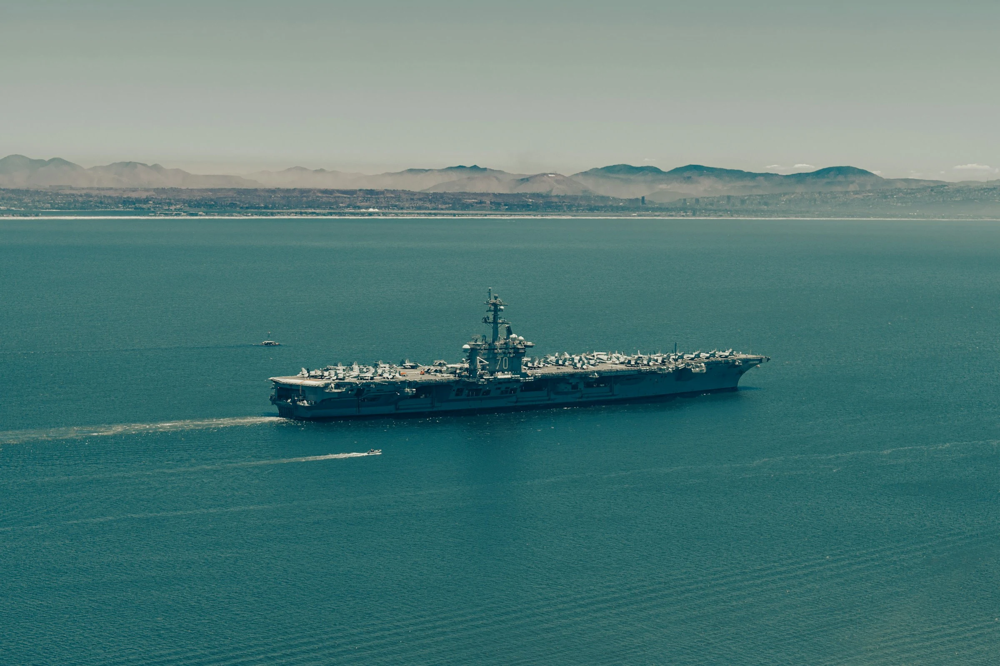

# The New Monroe Doctrine: Washington's War on Latin America's Sovereignty

> The strength of the imperialist system as a whole rests on the necessary inequality of its parts, and this inequality assumes ever more dramatic dimensions.
> — Eduardo Galeano, Open Veins of Latin America (1971)

Imperialism adapts, shifting its language and its tools, but its purpose remains: to assert control over a region's politics and resources. The recent U.S. campaign of strikes against small vessels in the Caribbean and eastern Pacific — and the reported selection of land targets in Venezuela — belongs to that long continuum. These actions go beyond drug-war policing. They revive the Monroe Doctrine in twenty-first century form.

The strikes have killed scores of people since September and spread fear along coasts and fishing communities.

Independent observers, UN human rights officials, and regional leaders have raised alarms about legality, transparency, and sovereignty. Reports now state that U.S. officials have identified ports, airstrips and military facilities inside Venezuela as potential land targets. That marks an escalation from interdiction at sea to the prospect of strikes on sovereign territory.

## The Escalating Logic of Imperial Force

The current campaign began publicly in early September and accelerated in October, with multiple announced strikes in a single day.

On **27 October 2025**, the Pentagon reported strikes on four vessels in the eastern Pacific that killed **14** people. By the end of October, reporting aggregated known deaths from the series of strikes at **around 61**.

Officials frame these actions as counter-narcotics and describe the targets as tied to organised trafficking networks. Critics call the numbers, the evidence, and the legal bases opaque.

Most troubling, reporting from major outlets indicates U.S. officials have identified land targets in Venezuela — facilities alleged to be used for trafficking by elements linked to the regime. Such lists reportedly include **military-controlled ports and airstrips**. If acted on, strikes against these sites would be a clear move from maritime interdiction into attacks on foreign soil. That is a different category of action with far wider legal and political consequences.

## Imperial Logic, Modern Tools

The Monroe Doctrine of **1823** proclaimed the Americas a U.S. sphere of influence. Over two centuries, that claim was enforced by invasions, coups, economic coercion, and proxy wars. Today, the vocabulary has shifted — from “manifest destiny” to “narco-terrorism” — and the weapons have changed — from marines to drones and precision munitions. Yet the grammar of hemispheric control persists.

When a superpower asserts the unilateral right to kill at sea, then prepares lists of targets on a neighbour's soil, it revives the core logic of Monroe: the hemisphere is a zone to be policed by one capital. The rhetoric of counter-narcotics conceals a strategic posture that privileges American judgement over regional sovereignty.

## From Marines to Missiles: The Long War on Latin America's Sovereignty

This is not new. The United States has repeatedly imposed its will on Latin America by force, subversion, and economic coercion — always wrapped in moral pretext.

In **1954**, the CIA overthrew Guatemala's elected government after it nationalised land belonging to the United Fruit Company. In **1961**, it launched the Bay of Pigs invasion to crush Cuba's revolution. In **1973**, it backed the Chilean coup that murdered Allende and installed Pinochet. In **1983**, it invaded **Grenada** under the guise of rescuing American students, killing dozens and reinstalling a compliant regime. In **1989**, it flattened neighbourhoods in **Panama City** to capture Noriega — another former U.S. asset gone rogue.

Each episode followed the same grammar: an invented emergency, a moral justification, and overwhelming force. The doctrines shifted — anti-communism, counter-terrorism, now counter-narcotics — but the substance remained constant. Washington claims the right to decide which governments may live, which movements may rise, and which lives may be taken in the name of order.

The strikes on boats off Venezuela's coast belong to that same imperial continuum. The methods evolve; the premise endures. What drones and precision missiles now perform from afar, marines once did by hand. The hemisphere remains treated not as a community of sovereign nations, but as a managed estate of empire.

## Mechanisms of Imperial Control

This campaign rests on three interlocking instruments.

**Legal stretching.**
Label a group or flow “narco-terror”, and the line between criminal law and armed conflict blurs. That stretching enables extraordinary measures the U.S. government argues are lawful. But many legal scholars and rights groups say the strikes lack a clear legal foundation under international law and may constitute extrajudicial killings.

**Military posture.**
The deployment of a carrier strike group and associated air assets transforms policing into a military operation. Such force concentration raises the stakes for miscalculation and sends a signal that strikes ashore are possible should political decisions be taken to escalate. The hardware is itself a political message.

**Narrative power.**
Public claims — “huge loads of drugs”, “narco-terrorists” — prime domestic and international audiences to accept extraordinary measures. Propaganda and framing create consent. Yet independent verification of the strikes' targets remains thin, and survivors' accounts and regional statements complicate the official story.

## The Human Cost of Imperial Action

The human toll is immediate and grave. Those killed are not abstract statistics; they are fishers, crew members, relatives.

Whole coastal communities now fear the sea that once provided their livelihoods. The strikes damage local trade, fishing and tourism — economies that sustain millions across the Caribbean and Pacific littorals.

Legally and diplomatically, the strikes erode norms. UN human rights experts warned that lethal force in international waters without a proper legal basis can amount to **extrajudicial executions**, and the UN High Commissioner for Human Rights has urged the U.S. to halt the strikes.

Such warnings underscore the risk: normalising unilateral lethal action risks setting a precedent that weakens international law for everyone.

Should the campaign move ashore, the risk of direct confrontation with Venezuelan forces, and a wider regional crisis, rises sharply. A miscalculation could draw in allied navies or provoke retaliatory measures.

The hemisphere is not a laboratory for experiments in remote warfare. Lives and livelihoods hang in the balance.

## Reclaiming Justice from Imperial Violence

This cannot be left to euphemism or executive fiat. Counter-narcotics requires cooperation and rule-bound action, not missiles in international waters.

- **Stop lethal strikes absent transparent evidence.** Any use of force must be subject to independent investigation. Findings must be public. Civilian casualties require accountability and reparations.
- **Rehabilitate regional mechanisms.** Drug interdiction is a shared problem. Solutions must be regional and multilateral under OAS and UN frameworks, not unilateral military campaigns.
- **Scrutinise legal claims.** Congress, international legal bodies and civil society must demand clarity: what legal authorities justify extraterritorial lethal force? War-making powers are not a blank cheque.
- **Address structural causes.** The demand for hard drugs in the Global North and the corruption and poverty that traffickers exploit are root problems. Invest in jobs, labour rights, and anti-corruption measures rather than normalising violence.
- **De-escalate militarily.** Pull back carrier groups and step up diplomacy before strikes on sovereign territory are authorised. The cost of escalation is too high.

## Resisting Imperial Expansion

The strikes at sea and the talk of land targets reveal a broader truth: empire does not vanish; it mutates. Urgency and security are invoked to justify extraordinary violence. The United States may frame these operations as a defence of American life, or they may be read as a claim on a hemisphere: the regained authority to act unilaterally where it deems fit.

Resisting this is not an excuse for illegal trafficking. It is a refusal to accept war as the primary instrument for social and political problems. Sovereignty, law, and human life must be valued above the convenience of a missile. Regional solidarity, independent investigation, and mass political pressure can still deny empires the legitimacy they seek.

— In solidarity with all those resisting imperial violence in Latin America and the Global South.
