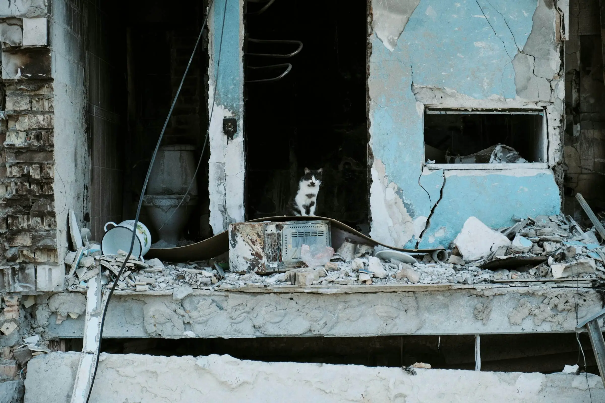

# Ukraine and the Empire of War: How Capital Profits from Catastrophe

> "When the rich wage war it's the poor who die."
> — Jean-Paul Sartre, The Devil and the Good Lord (1951)

The war in Ukraine reflects world order rather than being an exception to it.

A global system that feeds on catastrophe has found another vein to open: a machine that turns grief into profit, flags into franchises, and death into dividends.

To understand this war, we must look past propaganda and patriotism, past NATO's narratives and the Kremlin's revanchism, to what the conflict truly exposes: **capitalism at war with life itself.**

Rather than a "civilisational clash," this is a struggle between empires — one old, one resurgent — each sustained by extractive power and fossil capital. Ukraine has become their frontier, a place where the imperial ambitions of the West and Russia collide, and where ordinary people — workers, farmers, civilians — bear the heaviest cost.

---

## Empire's Footprints in History

The road to this war began long before 2022.
It runs through the ruins of 1991, when the Soviet Union's collapse opened the East to global capital. Western economists prescribed "shock therapy"; oligarchs and speculators carved up public wealth. The result was familiar: public misery, private enrichment, and a state hollowed out for sale.

Ukraine's post-independence political choices—embracing neoliberal restructuring, accepting Western conditionalities, and pursuing NATO membership—were not neutral decisions but active participation in imperial dynamics that made this conflict more likely. Each step toward NATO integration was presented as sovereignty but functioned as deeper integration into Western military and economic hegemony.

Then came NATO. Each expansion eastward was framed as "security," yet what it secured was **Western military and economic hegemony** — a market order backed by missiles. Europe never decolonised; it merely globalised its empire.

Russia, too, followed this neoliberal script. Under Putin, privatisation merged with nationalism — oil wealth sanctified as destiny. The Kremlin's wars, from Chechnya to Syria to Ukraine, became theatre for a petro-imperial regime that trades in both fossil fuels and fear.

Ukraine actively positioned itself as a frontline state in this imperial competition, accepting the role of buffer zone and battleground. Rather than simply being "left between these forces," Ukraine's leadership made strategic choices that deepened its position within competing imperial architectures.

**Even Ukraine's post-Soviet independence was conditioned by imperial logic.** In 1994, the _Budapest Memorandum_ saw Kyiv surrender the world's third-largest nuclear arsenal in exchange for "security assurances" from the U.S., U.K., and Russia — the same powers now exploiting or assaulting its sovereignty.

The collapse of that agreement exposes the truth beneath liberal diplomacy: under empire, _security is a commodity, and guarantees last only while profitable._ Ukraine's strategic choices to integrate with Western structures while maintaining extraction-based economic models made it a predictable flashpoint in competing imperial formations.

---

## War as a Profit Engine

Wars are not only fought; they are financed, speculated upon, and monetised.

Since 2022, **defence shares have surged by over 40%** in the U.S. and Europe.
Lockheed Martin, BAE Systems, Rheinmetall, and Thales celebrate quarterly earnings as civilians bury their dead.
**Shell, BP, and TotalEnergies** reap record profits from energy volatility. **BlackRock** and **JP Morgan** now plan Ukraine's "reconstruction" — a euphemism for the privatisation of its recovery.

Every missile launched is a market transaction. Every destroyed factory becomes a future investment site.
The International Monetary Fund's **$15 billion programme** binds Ukraine's postwar future to the old neoliberal doctrine: deregulate, privatise, repay. It is **structural violence rewritten as aid**.

This represents the recolonisation of crisis rather than solidarity.

---

## The Full Scope of Destruction

Behind every statistic is a body, a home, a field.
Tens of thousands dead. Millions displaced. Cities erased.

But the devastation extends beyond the human.
Ukraine's soil is poisoned with heavy metals; forests burned; rivers fouled.
The shelling near Zaporizhzhia's nuclear plant risks radiological ruin.
Agricultural land — once the breadbasket of Europe — is laced with mines and toxins.
The UN warns that environmental recovery may take **decades**, if it is possible at all.

War here is not only social catastrophe — it is **ecocide as strategy**, turning ecosystems into collateral and "reconstruction" into profit.

Across continents, the pattern repeats: from cobalt in Congo to gold in Sudan to the bombed soil of Donbas. The Earth itself has become collateral in empire's accounting.

---

## Selective Solidarity and Imperial Double Standards

Western governments proclaim defence of democracy, yet their solidarity remains selective.
They sanction Moscow while arming Riyadh, mourn Kyiv while enabling Gaza's siege, welcome white refugees while others drown in the Mediterranean.

Rather than moral inconsistency, this reflects **imperial consistency**.
Sovereignty is sacred in Europe but expendable in the Global South.
When the International Criminal Court indicts Putin, it is celebrated; when Palestinians seek justice, the same court is ignored.

Such hypocrisy hollows out international law and exposes the racial hierarchy embedded within it. The war in Ukraine, like those in Iraq or Libya, reveals that empire has not vanished — it has diversified.

---

## The Global South's Calculus of Survival

Across Africa, Asia, and Latin America, governments are pressed to choose sides. Yet neutrality is often the stance of survival, not indifference.

Sanctions inflate fuel and food prices; disrupted grain flows push millions into hunger. The war has triggered **the largest rise in food insecurity since 2008**, yet Western narratives reduce these consequences to footnotes.

The real divide transcends democracy versus autocracy — it is **imperial core versus periphery**.
Countries that reject alignment are scolded as "pro-authoritarian," while those that comply are rewarded with debt.

Still, the Global South resists being conscripted. BRICS diplomacy, African mediation, and South American non-alignment all signal a new geopolitical imagination: **a world no longer willing to kneel before empire's choice of enemies.**

---

## Persistence of Resistance

Even amid the wreckage, people resist.

- Ukrainian trade unions oppose wartime deregulation that erodes workers' rights.
- Feminist and socialist collectives demand reconstruction for people, not capital.
- Russian anti-war activists risk prison to speak truth.
- Across Europe, climate movements denounce the greenwashing of militarism under the banner of "energy security."

Their struggles remind us: **the peace worth fighting for represents liberation, not pacification** — from oligarchy, from fossil dependence, from the global war economy itself.

---

## Reimagining Peace Beyond Empire

A just peace cannot be negotiated by those who profit from destruction.
It must be **demilitarised, decolonised, and ecological** — grounded in cooperation, not domination.

That means:

- Converting war industries to tools for renewable reconstruction.
- Cancelling Ukraine's external debt, not deepening its bondage.
- Ending NATO expansion and Russian aggression alike through a **new collective security architecture**.
- Redirecting global budgets from militaries to climate adaptation, healthcare, and food sovereignty.

This represents survival, not utopia.
Every tank built is a solar panel not made. Every missile launched is another ton of carbon in the sky.
War is the climate crisis in military form.

---

## Dismantling the Machinery of Domination

Ukraine's tragedy is planetary. It exposes the connective tissue of the system we name: **capitalism, colonialism, and climate collapse as one machinery of domination.**

The same order that exploits Congolese miners, fuels Sudan's militias, and flattens Gaza now grinds Ukrainians beneath its wheels. Different languages, same empire.

We cannot end this war by choosing which empire to believe.
We end it by dismantling the system that makes empires possible — the one that turns land into property, labour into debt, and life into profit.

> "True peace is not merely the absence of tension: it is the presence of justice."
> — Martin Luther King Jr, Stride Toward Freedom (1958)

Justice begins when we name the enemy correctly: not Russia or NATO alone, but the **global order that feeds on both**.

— In solidarity with the peoples of Ukraine, Russia, and the Global South; with all who resist the empire of war, for people and planet.
