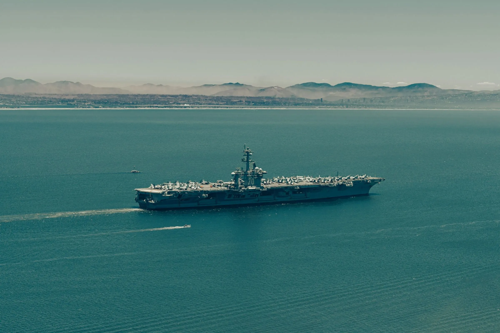

# The New Monroe Doctrine: Washington's War on Latin America's Sovereignty

> The strength of the imperialist system as a whole rests on the necessary inequality of its parts, and this inequality assumes ever more dramatic dimensions.
> — Eduardo Galeano, Open Veins of Latin America (1971)

Imperialism adapts — language and tools shift; purpose endures: assert control over regional politics and resources. The recent US campaign against small vessels — and reported Venezuelan land target lists — sits in that continuum. These actions exceed drug-war policing and revive the Monroe Doctrine.

Strikes have killed scores since September and spread fear along coasts and fishing communities.

Independent observers, UN human rights officials and regional leaders raise alarms about legality, transparency and sovereignty. Reports state US officials have identified ports, airstrips and military facilities inside Venezuela as potential land targets — escalating from maritime interdiction to prospective strikes on sovereign territory.

## The Escalating Logic of Imperial Force

The campaign began publicly in early September and accelerated in October with multiple strikes announced in single days.

On **27 October 2025**, the Pentagon reported strikes on four vessels in the eastern Pacific that killed **14** people. By the end of October, reporting aggregated known deaths from the series of strikes at **around 61**.

Officials frame actions as counter-narcotics, describing targets as organised trafficking networks. Critics call numbers, evidence and legal bases opaque; independent verification remains limited.

Most troubling, major outlets report US officials have identified Venezuelan land targets — facilities alleged to be used for trafficking by regime-linked elements, including **military-controlled ports and airstrips**. Strikes would move from maritime interdiction to attacks on foreign soil — qualitatively different with wider consequences.

## Imperial Logic, Modern Tools

The Monroe Doctrine of **1823** proclaimed the Americas a US sphere of influence. Enforcement followed via invasions, coups, economic coercion and proxy wars. Vocabulary shifts — "manifest destiny" to "narco-terrorism"; weapons shift — marines to drones; grammar of control persists.

When a superpower asserts unilateral right to kill at sea then prepares target lists ashore, it revives Monroe’s core logic: hemisphere policed by one capital. Counter-narcotics rhetoric conceals a strategic posture privileging US judgement over regional sovereignty.

## From Marines to Missiles: The Long War on Latin America's Sovereignty

Not new: the US has repeatedly imposed its will on Latin America by force, subversion and economic coercion — wrapped in moral pretext.

**1954**: CIA overthrows Guatemala's elected government after land nationalisation. **1961**: Bay of Pigs invasion targets Cuba’s revolution. **1973**: backs Chilean coup installing Pinochet. **1983**: invades **Grenada** under rescue guise. **1989**: flattens **Panama City** neighbourhoods to capture Noriega.

Each episode: invented emergency, moral justification, overwhelming force. Doctrines shift — anti-communism, counter-terrorism, now counter-narcotics — substance constant. Washington claims power to decide which governments live, which movements rise, which lives may be taken.

Strikes off Venezuela belong to the same continuum. Methods evolve; premise endures. What drones and precision missiles perform from afar, marines once did by hand. Hemisphere treated as managed estate, not sovereign community.

## Mechanisms of Imperial Control

This campaign rests on three interlocking instruments.

**Legal stretching.**
Label a group or flow "narco-terror" and the line between criminal law and armed conflict blurs — enabling extraordinary measures argued lawful. Many scholars and rights groups say strikes lack clear international legal foundation and may constitute extrajudicial killings.

**Military posture.**
Deployment of a carrier strike group and air assets transforms policing into military operation — raising stakes for miscalculation and signalling ashore strikes are possible. Hardware is political message.

**Narrative power.**
Public claims — "huge loads of drugs", "narco-terrorists" — prime audiences to accept extraordinary measures. Propaganda and framing create consent. Independent verification thin; survivor and regional accounts complicate the story.

## The Human Cost of Imperial Action

Human toll is immediate and grave. Those killed are fishers, crew members, relatives — not abstractions.

Coastal communities now fear seas that once sustained livelihoods. Strikes damage trade, fishing and tourism — economies sustaining millions across Caribbean and Pacific littorals.

Legally and diplomatically norms erode. UN experts warn lethal force in international waters without legal basis can amount to **extrajudicial executions**; the High Commissioner urges a halt.

Warnings underscore risk: normalising unilateral lethal action sets precedent weakening international law for all.

If campaign moves ashore, risk of direct confrontation with Venezuelan forces and wider regional crisis rises sharply. Miscalculation could draw in allied navies or provoke retaliation.

The hemisphere is not a laboratory for remote warfare. Lives and livelihoods hang in the balance.

## Reclaiming Justice from Imperial Violence

This cannot be left to euphemism or executive fiat. Counter-narcotics requires cooperative, rule-bound action — not missiles.

- **Halt lethal strikes absent transparent evidence.** Force must face independent investigation; findings public; civilian casualties trigger accountability and reparations.
- **Rehabilitate regional mechanisms.** Interdiction is shared; solutions regional/multilateral under OAS & UN — not unilateral campaigns.
- **Scrutinise legal claims.** Demand clarity: what authority justifies extraterritorial lethal force? War-making powers are not a blank cheque.
- **Address structural causes.** Tackle demand, corruption and poverty via jobs, labour rights and anti-corruption — not normalised violence.
- **De-escalate militarily.** Pull back carrier groups; step up diplomacy before authorising strikes ashore.

## Resisting Imperial Expansion

Strikes at sea and talk of land targets reveal empire does not vanish; it mutates. Urgency and security justify extraordinary violence. The US frames operations as defence; they read as claim on hemisphere: regained authority to act unilaterally.

Resisting is not an excuse for trafficking; it is refusal to accept war as primary instrument. Sovereignty, law and human life must outrank convenience of a missile. Solidarity, investigation and mass pressure can deny imperial legitimacy.

— In solidarity with all resisting imperial violence in Latin America and the Global South.
