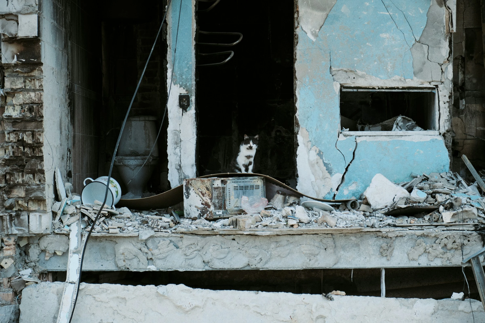

# Ukraine and the Empire of War: How Capital Profits from Catastrophe

> "When the rich wage war it's the poor who die."
> — Jean-Paul Sartre, The Devil and the Good Lord (1951)

The war in Ukraine reflects world order rather than represents an exception.

A global system that feeds on catastrophe has found another vein: a machine turning grief into profit, flags into franchises, death into dividends.

To understand this war we must look past propaganda and patriotism, past NATO narratives and Kremlin revanchism, to what the conflict exposes: **capitalism at war with life itself.**

Not a "civilisational clash" but a struggle between empires — one old, one resurgent — each sustained by extractive power and fossil capital. Ukraine becomes frontier of Western and Russian ambition; ordinary people — workers, farmers, civilians — bear the cost.

---

## Empire's Footprints in History

The road preceded 2022. It runs through 1991’s ruins when Soviet collapse opened the East to global capital. Western economists prescribed "shock therapy"; oligarchs carved public wealth. Result: public misery, private enrichment, state hollowed out for sale.

Ukraine's post-independence choices — neoliberal restructuring, Western conditionalities, NATO pursuit — were not neutral; they embedded imperial dynamics making conflict more likely. Each step toward NATO integration was presented as sovereignty yet deepened Western military and economic hegemony.

NATO expansion eastward was framed as "security" yet secured **Western military and economic hegemony** — market order backed by missiles. Europe never decolonised; it globalised empire.

Russia followed a neoliberal script. Under Putin privatisation merged with nationalism — oil wealth sanctified as destiny. Wars from Chechnya to Syria to Ukraine became theatre for petro-imperial regime trading in fossil fuels and fear.

Ukraine positioned itself as frontline state — buffer and battleground — through strategic choices deepening its place within competing imperial architectures.

**Post-Soviet independence was conditioned by imperial logic.** The 1994 _Budapest Memorandum_ saw Kyiv surrender the world's third-largest nuclear arsenal for "security assurances" from the US, UK and Russia — powers now exploiting or assaulting its sovereignty.

Collapse of that agreement exposes liberal diplomacy's truth: under empire _security is commodity; guarantees last only while profitable_. Ukraine's integration choices, alongside extraction-based economic models, made it a predictable flashpoint.

---

## War as a Profit Engine

Wars are not only fought; they are financed, speculated upon, and monetised.

Since 2022 **defence shares surged over 40%** in the US and Europe.
Lockheed Martin, BAE Systems, Rheinmetall and Thales celebrate earnings as civilians bury their dead.
**Shell, BP, TotalEnergies** reap record profits from volatility. **BlackRock** and **JP Morgan** plan Ukraine's "reconstruction" — euphemism for privatised recovery.

Every missile launched is a market transaction. Every destroyed factory becomes future investment site.
The IMF’s **$15 billion programme** binds Ukraine’s post‑war future to old doctrine: deregulate, privatise, repay — **structural violence rewritten as aid**.

This is recolonisation of crisis, not solidarity.

---

## The Full Scope of Destruction

Behind every statistic is a body, a home, a field.
Tens of thousands dead; millions displaced; cities erased.

Devastation extends beyond the human.
Ukraine's soil poisoned with heavy metals; forests burned; rivers fouled.
Shelling near Zaporizhzhia's nuclear plant risks radiological ruin.
Agricultural land — once breadbasket of Europe — is laced with mines and toxins.
UN warns environmental recovery may take **decades**, if possible at all.

War is not only social catastrophe — it is **ecocide as strategy**, turning ecosystems into collateral and "reconstruction" into profit.

Across continents, the pattern repeats: from cobalt in Congo to gold in Sudan to the bombed soil of Donbas. The Earth itself has become collateral in empire's accounting, with ecosystems sacrificed for the machinery of accumulation.

---

## Selective Solidarity and Imperial Double Standards

Western governments proclaim defence of democracy yet solidarity remains selective.
They sanction Moscow while arming Riyadh, mourn Kyiv while enabling Gaza’s siege, welcome some refugees while others drown in the Mediterranean.

This reflects **imperial consistency** not moral confusion.
Sovereignty sacred in Europe; expendable in the Global South.
ICC indictment of Putin celebrated; Palestinian appeals ignored.

Hypocrisy hollows international law and exposes racial hierarchy. War in Ukraine, like Iraq or Libya, reveals empire has diversified, not vanished.

---

## The Global South's Calculus of Survival

Across Africa, Asia and Latin America governments are pressed to choose sides; neutrality often becomes stance of survival, not indifference.

Sanctions inflate fuel and food prices; disrupted grain flows push millions into hunger. War triggers **largest rise in food insecurity since 2008** yet Western narratives reduce consequences to footnotes.

Real divide transcends democracy vs autocracy — it is **imperial core versus periphery**.
Countries rejecting alignment scolded as "pro-authoritarian"; those complying rewarded with debt.

Still the Global South resists conscription. BRICS diplomacy, African mediation, South American non-alignment signal geopolitical imagination: **a world unwilling to kneel before empire's chosen enemies.**

---

## Persistence of Resistance

Even amid wreckage, people resist.

- Ukrainian trade unions oppose wartime deregulation eroding rights.
- Feminist and socialist collectives demand reconstruction for people not capital.
- Russian anti-war activists risk prison to speak truth.
- European climate movements denounce greenwashing of militarism as "energy security".

Their struggles remind: **peace worth fighting for is liberation, not pacification** — from oligarchy, fossil dependence and the war economy.

---

## Reimagining Peace Beyond Empire

Just peace cannot be negotiated by profiteers of destruction.
It must be **demilitarised, decolonised and ecological** — grounded in cooperation not domination.

That means:

- Convert war industries to renewable reconstruction.
- Cancel Ukraine's external debt, not deepen bondage.
- End NATO expansion and Russian aggression through **new collective security architecture**.
- Redirect budgets from militaries to climate adaptation, healthcare and food sovereignty.

This represents survival, not utopia.
Every tank built is a solar panel not made. Every missile launched is another ton of carbon in the sky.
War is the climate crisis in military form.

---

## Dismantling the Machinery of Domination

Ukraine's tragedy is planetary. It exposes connective tissue of the system: **capitalism, colonialism and climate collapse as one machinery of domination.**

The same order exploiting Congolese miners, fueling Sudan's militias and flattening Gaza now grinds Ukrainians. Different languages; same empire.

We cannot end this war by choosing which empire to believe; we end it by dismantling the system that makes empires possible — turning land into property, labour into debt, life into profit.

> "True peace is not merely the absence of tension: it is the presence of justice."
> — Martin Luther King Jr, Stride Toward Freedom (1958)

Justice begins when we name the enemy: not Russia or NATO alone, but the **global order feeding on both**.

— In solidarity with peoples of Ukraine, Russia and the Global South; with all who resist the empire of war — for people and planet.
